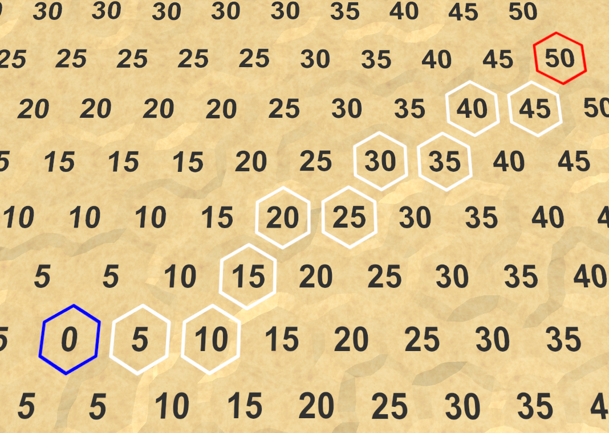
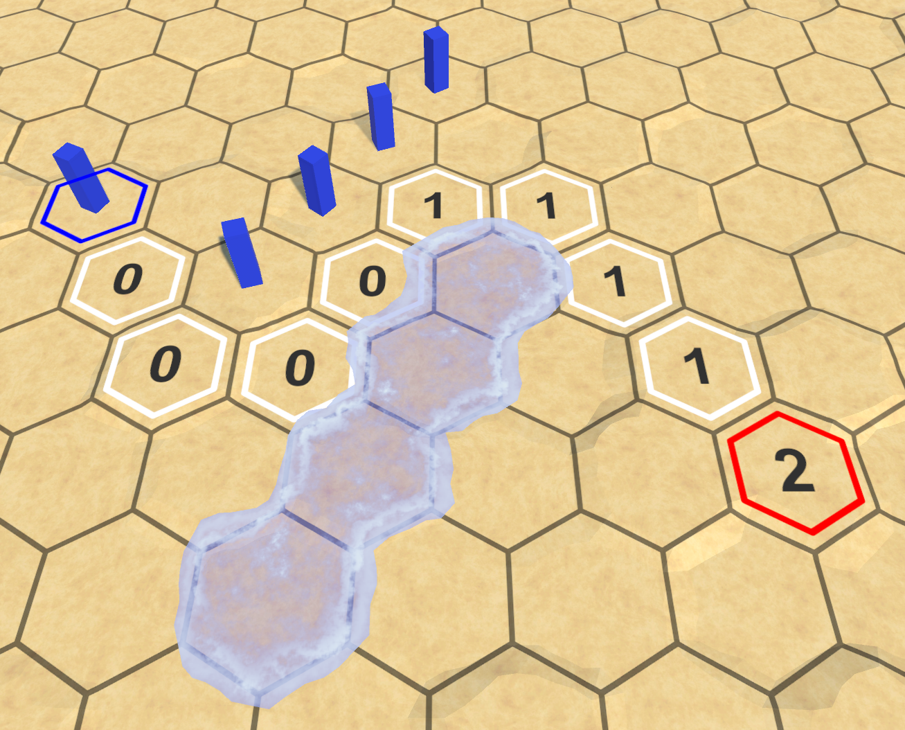

### Unity Hex Map  

Catlike Coding의 Unity Hex Map 튜토리얼로 배우며 구현해 본 간단한 헥사 타일맵 프로젝트.  

procedural mesh generation과 타일맵에서의 경로 탐색 알고리즘을 학습하는 걸 목표로 진행.  

---
경로 탐색 (Pathfinding)

마우스 클릭으로 시작 셀과 도착 셀을 지정하면, 두 지점 사이의 최단 경로를 찾아 표시.  

  

조금 더 복잡한 지형에서  

  

다른 유닛과 일부 지형을 피해서 경로를 찾는 예시(거리가 아닌 이동에 필요한 턴 표시)

---
🛠️ 향후 계획  
- A* 알고리즘 적용...
- Built-in 렌더링을 기준으로 작성된 텍스쳐를 새 유니티 버전(URP)에 맞게 수정 필요(가능할지 모르겠음)  
---
📚 참고 자료  
- [Catlike Coding: Hex Map Tutorials](https://catlikecoding.com/)
