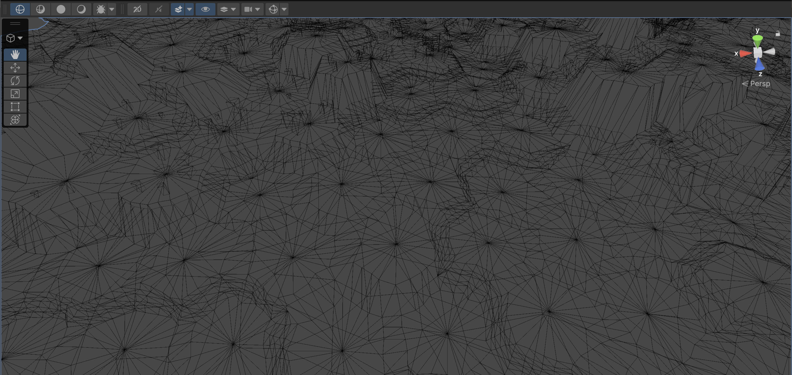
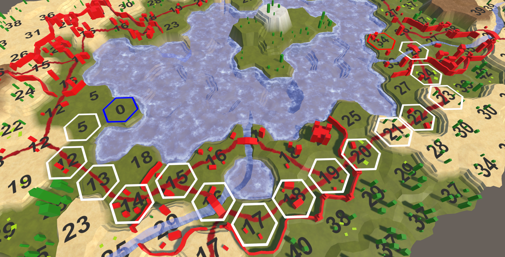
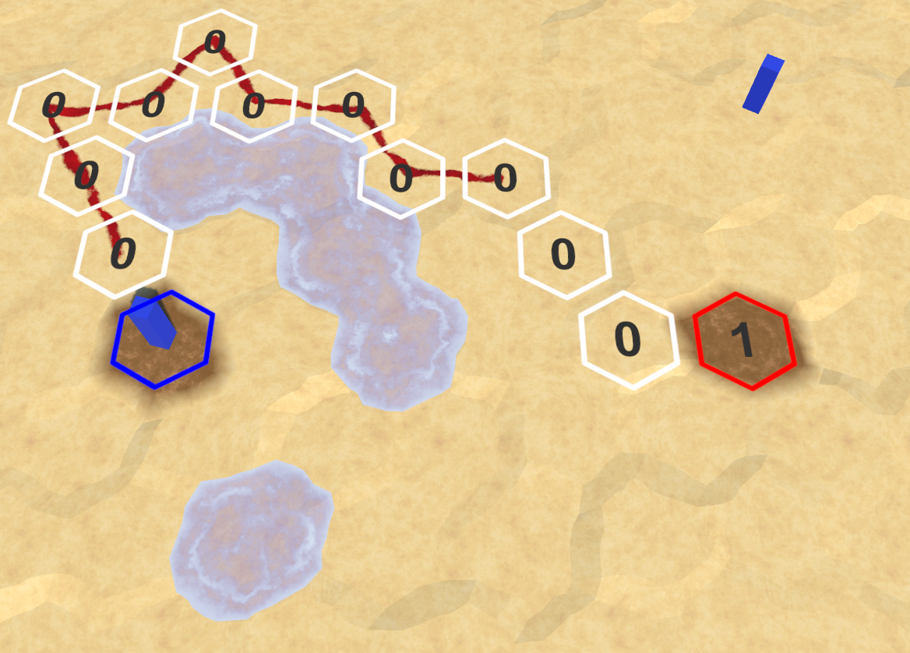
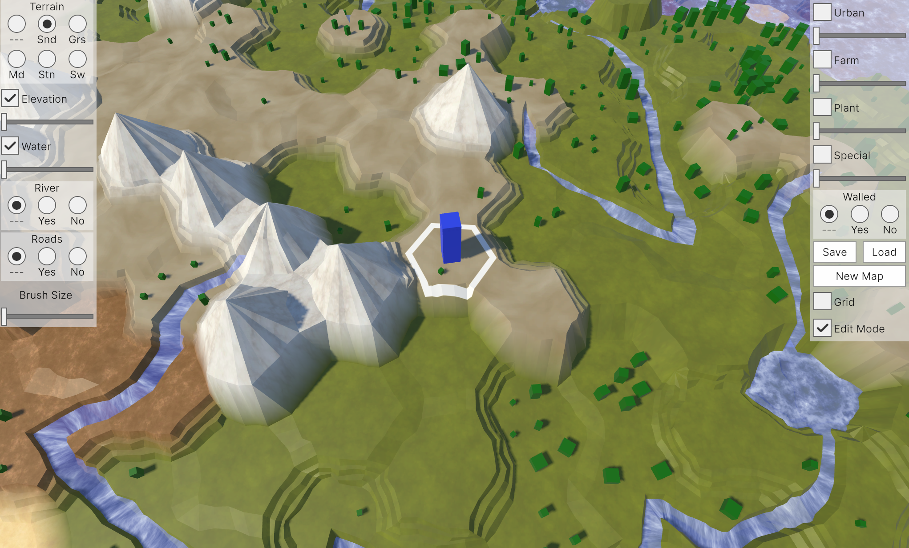
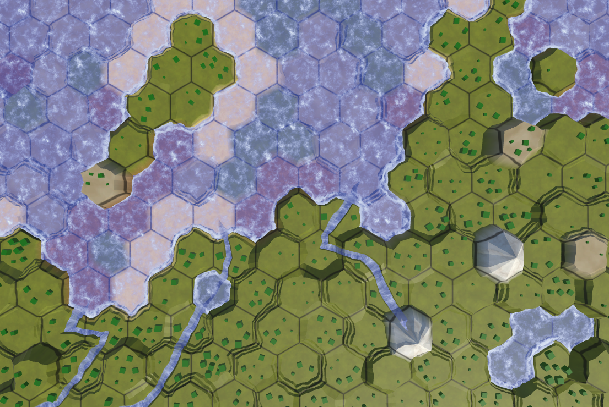

### Unity Hex Map  

Catlike Coding의 Unity Hex Map 튜토리얼로 배우며 구현해 본 간단한 헥사 타일맵 프로젝트.

(Built-in에서 URP로 수정)

Unity에서 procedural mesh generation과 타일맵에서의 경로 탐색 알고리즘을 학습하는 걸 목표로 진행했습니다.
프로젝트가 진행됨에 따라 자연스러운 바이옴 생성을 위해 펄린 노이즈뿐만 아니라 시뮬레이션 사용.

---

외부에서 가져온 에셋이 아닌, 정점(Vertex)과 삼각형(Triangle) 데이터를 직접 계산해 동적으로 mesh를 생성합니다.

  

경로 탐색 (Pathfinding) - A* 알고리즘

마우스 클릭으로 시작 셀과 도착 셀을 지정하면, 두 지점 사이의 비용을 계산해 최단 경로를 찾습니다    

  

다른 유닛과 일부 지형을 피해서 경로를 찾는 예시  
(거리가 아닌 이동에 필요한 턴 표시)  

  

간단한 전장의 안개입니다.

처음 만들었던 간단한 맵.
시드를 통해 생성하고 높이에 따라 다른 지형을 사용하는 원시적인 방법이었습니다.

자연스러운 생성을 위해 시뮬레이션을 적용한 대형 맵입니다.

유명한 게임에 자주 등장하는 산을 추가해봤습니다.
옆의 사진은 격자를 켰을 때의 모습입니다.

<table>
  <tr>
    <td></td>
    <td></td>
  </tr>
  <tr>
    <td align="center">유닛이 통과할 수 없습니다</td>
    <td align="center">노이즈 때문에 조금씩 벗어나는 게 보입니다</td>
  </tr>
</table>

---
🛠️ 향후 계획  
- 산맥처럼 여러 산들이 생겼을 때 서로 자연스럽게 연결하기.
- 유닛을 이용한 도시, 숲과의 상호작용
- (해결)Built-in 렌더링을 기준으로 작성된 텍스쳐를 새 유니티 버전(URP)에 맞게 수정
---
📚 참고 자료  
- [Catlike Coding: Hex Map Tutorials](https://catlikecoding.com/)
