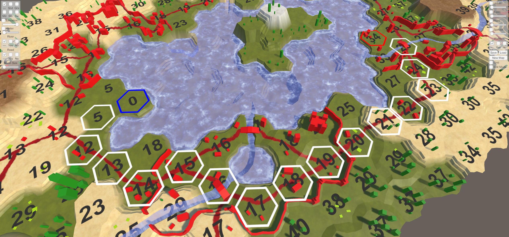

###Unity Hex Map
Catlike Coding의 Unity Hex Map 튜토리얼을 바탕으로 구현한 헥사 타일맵 프로젝트.
procedural mesh generation과 타일맵에서의 경로 탐색 알고리즘을 학습하는 것을 목표로 진행했습니다.

 

경로 탐색 (Pathfinding)
마우스 클릭으로 시작 셀과 도착 셀을 지정하면, 두 지점 사이의 최단 경로를 찾아 시각적으로 표시.

 

🛠️ 향후 계획
- 현재는 **Pathfinding 알고리즘**으로 단순 BFS 적용 -> A* 알고리즘 적용 예정
- Built-in 렌더링을 기준으로 작성된 텍스쳐를 새 유니티 버전(URP)에 맞게 수정 필요(가능할지 모르겠음) 

📚 참고 자료
- [Catlike Coding: Hex Map Tutorials](https://catlikecoding.com/)  
